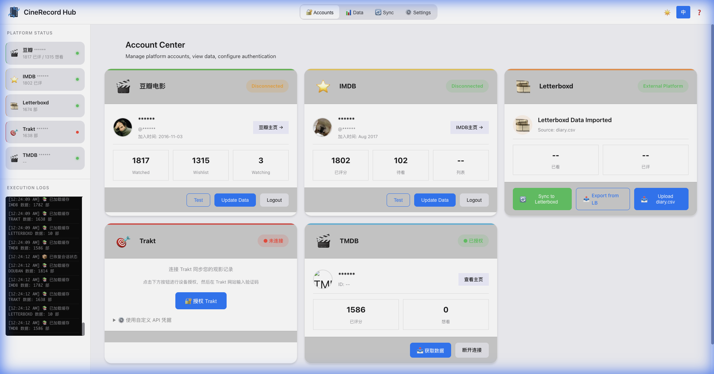
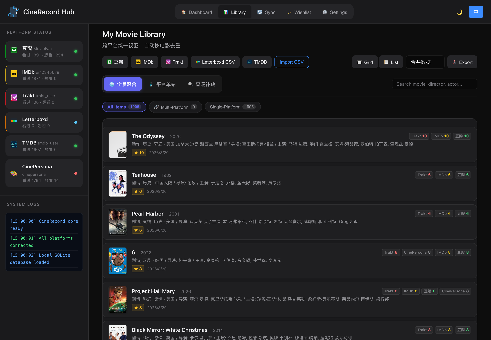
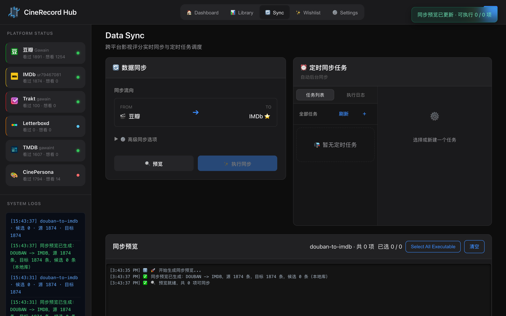

# 🎬 CineRecord v2 (Rust Version)

CineRecord is a local-first movie collection manager, cross-platform synchronization, and wishlist organizer.

CineRecord v2 is a full-stack rewrite of the original Python/Flask codebase. The backend is rewritten in highly optimized **Rust**, and the storage is migrated to a local **SQLite** database. The web interface is directly served by a single compiled binary—**no Python, Node.js, or external database services are required**.

<div align="center">
  
  <p><i>Workflow Walkthrough: Account status, manual/scheduled sync runs (Bilingual Demo)</i></p>
</div>

---

## 📸 Screenshots

<div align="center">
  
  <p><i>Dashboard: Account connectivity status and overall stats</i></p>

  <br>

  
  <p><i>Unified Library: Cross-platform movie collection aggregator & search</i></p>

  <br>

  
  <p><i>Sync Console: Delta preview, individual item actions, and live SSE logging</i></p>
</div>

---

## ✨ Key Features

### 🌐 Platform Compatibility Matrix

| Platform | Ratings Fetch | Watchlist Fetch | Sync Target | Auth & Integration Method |
| :--- | :---: | :---: | :---: | :--- |
| **🎬 Douban** | ✅ | ✅ | ✅ | Cookie Import / Automated login via frontend WebView |
| **⭐ IMDb** | ✅ | ✅ | ✅ | Cookie-based connection validation |
| **🎯 Trakt** | ✅ | ✅ | ✅ | Official OAuth Device flow / Two-way sync for ratings and watchlists |
| **🎬 TMDB** | ✅ | ✅ | ✅ | API Key + User Session verification |
| **🎨 CinePersona** | ✅ | ✅ | ✅ | API Key / Open API bidirectional sync |
| **✉️ Letterboxd** | ✅ (Import) | ✅ (Import) | ⚠️ (Export) | Local `diary.csv` / `watchlist.csv` import/export |
| **🎬 Media Server** | ✅ (Deduplicate) | — | — | Plex / Emby / Jellyfin API integration & client playback links |

### ⚡ Core Capabilities

* **🚀 Lightweight & High Performance**: The compiled binary is only ~10MB with extremely low memory usage (typically ~15MB resident), ensuring instant app startup and fast response times.
* **📊 Unified Library**: Consolidates watched history from all platforms, deduplicates entries using IMDB/TMDB IDs, and enriches data with director, genres, countries, and runtimes.
* **📅 Smart Wishlist**: Aggregate watchlists across different accounts. Features advanced filters for unreleased files and supports the **"Sync Wishlist to CinePersona"** push mechanism.
* **🔍 Media Server Deduplication & Direct Play**: Connects to your Plex, Emby, or Jellyfin library. Automatically scans your wishlist against your media server to find missing content. Clicking file names directly launches the native player.
* **⚙️ Visual Scheduler**: Built-in cron-based background scheduler for automated sync runs with a live log console streaming via SSE.
* **🔒 Privacy-First & Offline-First**: Sensitive credentials like Cookies, API keys, and OAuth Tokens are encrypted locally using AES 128-bit keys. There is no telemetry or data sent to third-party servers.

---

## 🚀 Quick Start

### Run from Source

Ensure you have the Rust toolchain installed (Rust 1.75+ recommended):

```bash
# 1. Clone the repository
git clone https://github.com/Gawain12/CineRecord.git
cd CineRecord

# 2. Run the Axum server
cargo run -p cinerecord-server
```

Open your browser and navigate to [http://127.0.0.1:18000](http://127.0.0.1:18000).

### Docker Deployment

For running on servers or NAS devices:

```bash
docker compose up -d --build
```
The service will be listening on `http://127.0.0.1:18000`. Persistent database and configuration files are stored locally in the `./cinerecord-data` directory.

---

## 📦 Packaging and Distribution

CineRecord features automated native packaging scripts to bundle everything into standalone desktop apps without external runtimes.

### 🍎 macOS
Runs the packaging script to generate high-resolution `.icns` assets using `sips` and `iconutil`, compile release builds, and wrap them in DMG disk images and ZIP archives:
```bash
./scripts/package_rust_macos.sh
```
* **Output**: `dist-rust/CineRecord.app` / `CineRecord-macOS-arm64.dmg`.
* Double-clicking starts the background daemon and opens the web portal in your default browser.

### 🔌 Windows
Runs the script in PowerShell to embed metadata icons and build a single executable:
```powershell
.\scripts\package_rust_windows.ps1
```
* **Output**: `dist-rust/CineRecord-Windows-x64.exe` and its companion ZIP release.

---

## ⚙️ Configuration & Environment Variables

CineRecord v2 stores configuration, SQLite databases, and logs in standard paths:
* **macOS**: `~/Library/Application Support/CineRecord`
* **Windows**: `%APPDATA%\CineRecord`
* **Linux**: `$XDG_DATA_HOME/cinerecord` or `~/.local/share/cinerecord`

Behavior can be customized using the following environment variables:

| Variable | Default Value | Description |
| :--- | :--- | :--- |
| `CINERECORD_HOME` | System Default Path | Overrides the root directory for configuration, databases, and logs. |
| `CINERECORD_HOST` | `127.0.0.1` | IP address to bind the service to. |
| `CINERECORD_PORT` | `18000` | Port number to bind the service to. |
| `CINERECORD_PORTABLE` | `false` | If set to `true`, stores all runtime data in the current working directory (perfect for USB drives). |
| `RUST_LOG` | `info,tower_http=warn` | Log level for the Rust server console. |

---

## 🛡️ Sync Protection Mechanisms

CineRecord employs multiple safeguards to prevent sync conflicts and data corruption on your target profiles:
1. **Double-Fetch Verification**: Sync previews are initially created from local databases for speed. Before committing writes, a **silent remote refresh** is triggered to verify no newer changes exist on the cloud.
2. **Add-Only Mode**: The sync defaults to "Only New" mode. Local unrated movies will never overwrite existing ratings on target platforms.
3. **TV Show Filter**: Because TMDB, Letterboxd, and CinePersona handle TV show structures differently, sync jobs auto-filter standard multi-season TV shows to avoid messy cross-platform logging.
4. **Itemized Review**: Before running any sync, users can manually select, deselect, or review every single action item in the preview list.

---

## ♻️ Migrating from Legacy Python

The legacy Python codebase is temporarily kept under the `web/` directory for reference and comparison purposes.

If you are a user of the Python version of CineRecord, you can migrate your existing history with one click:
1. Navigate to the CineRecord v2 dashboard and open a platform card.
2. Click **"Import Legacy CSV"**.
3. The server will search for Python-era exports in `data/` (e.g. `douban_*_wish.csv`, `imdb_*_ratings.csv`) and import them into the v2 SQLite database.

---

## 📜 License

[MIT License](./LICENSE)
