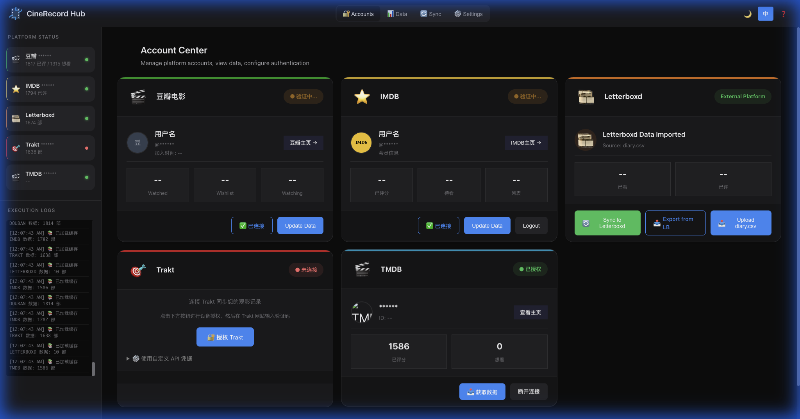
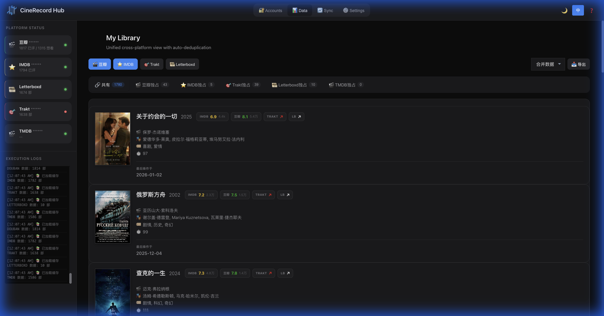

# 🎬 CineRecord Hub

<div align="center">

**Your Personal Movie Data Command Center**

Sync, Back up, and Manage your movie ratings across Douban, IMDb, Trakt, TMDB, and Letterboxd.

[](https://python.org)
[](https://flask.palletsprojects.com)
[](https://opensource.org/licenses/MIT)

[English](./README.en.md) | [中文文档](./README.md)

</div>

---

## 📸 Interface Preview

<div align="center">
  
  <p><i>Dashboard: Account Status & Overview (Masked User Info)</i></p>
  
  <br>
  
  
  <p><i>Unified Library: Cross-Platform Collection</i></p>
</div>

---

## ✨ Key Features

### 🌐 Multi-Platform Support

| Platform | Fetch Ratings | Sync To | Auth Method |
|----------|:-------------:|:-------:|-------------|
| **Douban** | ✅ | ✅ | Cookie / Auto-Login |
| **IMDb** | ✅ | ✅ | Cookie / Auto-Login |
| **Trakt** | ✅ | ✅ | OAuth Device Flow |
| **TMDB** | ✅ | ✅ | API Key + Session |
| **Letterboxd**| ✅ | ⚠️ | CSV Import / Export |

### ⚡ Core Capabilities

-   **Unified Library**: View all your watched movies in one place, auto-deduplicated.
-   **Bi-Directional Sync**: Keep your ratings consistent across all platforms (e.g., Douban ↔ IMDb).
-   **Task Scheduler**: **[NEW]** Set up automated daily/weekly sync tasks.
-   **Privacy First**: All data and cookies are stored locally on your machine.
-   **Dark Mode UI**: A premium, cinematic visual experience.

---

## 🚀 Quick Start

### Standard Installation

1.  **Clone the repository**
    ```bash
    git clone https://github.com/YOUR_USERNAME/CineRecord.git
    cd CineRecord
    ```

2.  **Install Dependencies**
    ```bash
    pip install -r requirements.txt
    ```

3.  **Run the Application**
    ```bash
    python web/app.py
    ```
    The app will open automatically at `http://127.0.0.1:8000`.

---

## 📖 User Guide

### 1. Connect Accounts
Navigate to the **Accounts** tab or different platform cards.
-   **Douban/IMDb**: Use the "Auto Login" button (macOS) or manually paste your cookies in **Settings**.
-   **Trakt**: Click "Connect", get your 8-digit code, and authorize on Trakt.tv.
-   **TMDB**: Enter your API Key in Settings to enable search and sync.

### 2. Sync Ratings
Go to the **Sync** tab.
-   **Manual Sync**: Select Source (e.g., Douban) and Target (e.g., Trakt), click "Preview", then "Execute".
-   **Scheduled Sync**: Click "New Task", choose your sync direction and frequency (e.g., "Daily at 2:00 AM"), and enable it. The app will handle the rest in the background.

### 3. View Library
The **Data** tab serves as your unified movie database. Filter by platform exclusives to see which movies are missing from your other profiles.

---

## 🛠 Project Structure

```
CineRecord/
├── web/
│   ├── app.py             # Backend Application Entry
│   ├── scheduler.py       # Task Scheduler Service
│   ├── logic.py           # Sync & Merge Logic
│   ├── static/            # JS (App, Scheduler, i18n) & CSS
│   └── templates/         # HTML Views
├── scrapers/              # Platform Connectors
│   ├── douban_scraper.py
│   ├── imdb_scraper.py
│   ├── trakt_client.py
│   └── tmdb_client.py
└── data/                  # Local Data Storage
```

---

## 🛡️ Privacy & Security

-   **Local Only**: Your cookies and movie data never leave your local network.
-   **Open Source**: The code is fully transparent and auditable.
-   **No Tracking**: We do not collect usage data.

---

## 🤝 Contributing

Contributions are welcome! Please check `agent.md` for development guidelines.

## 📜 License

MIT License. See [LICENSE](./LICENSE) for details.
