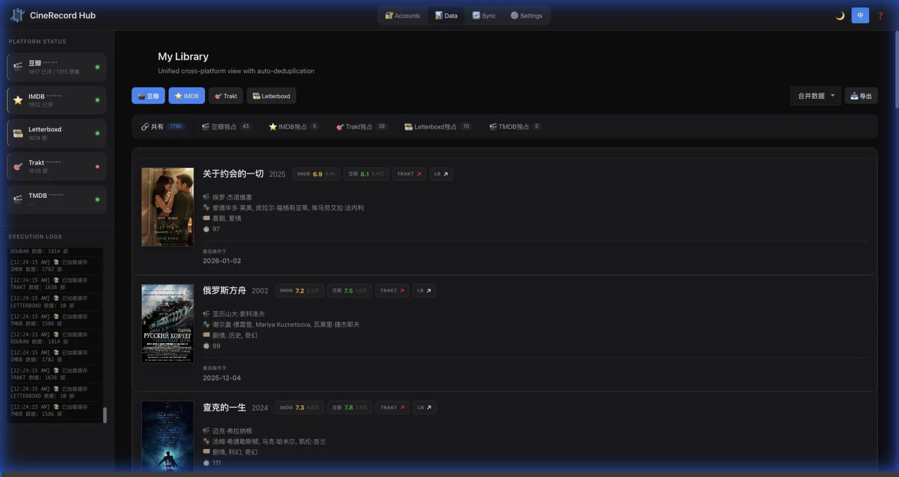
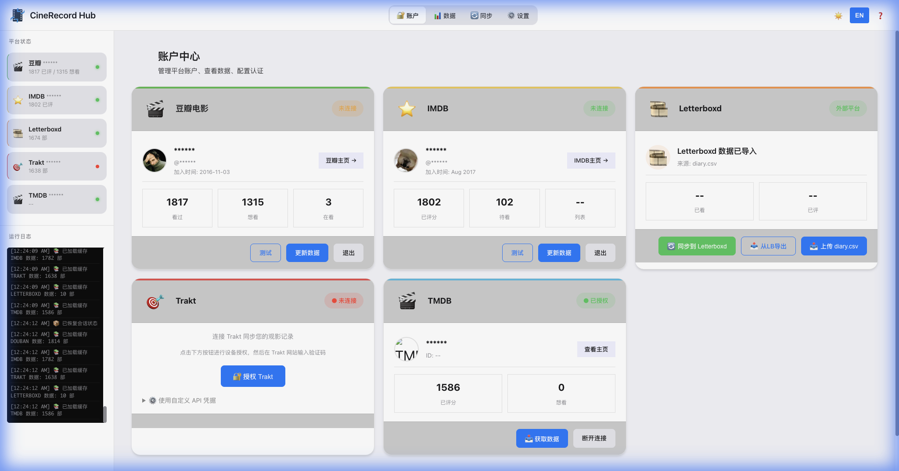
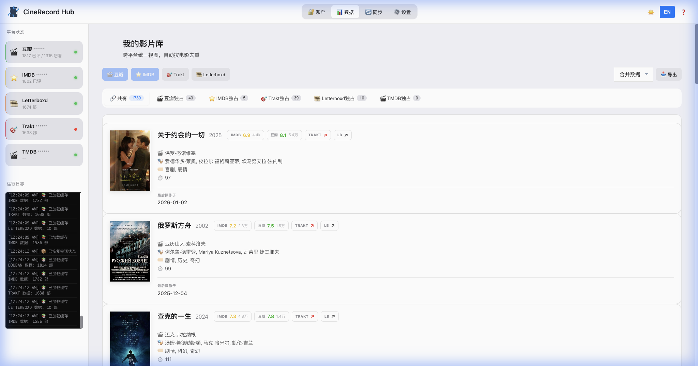
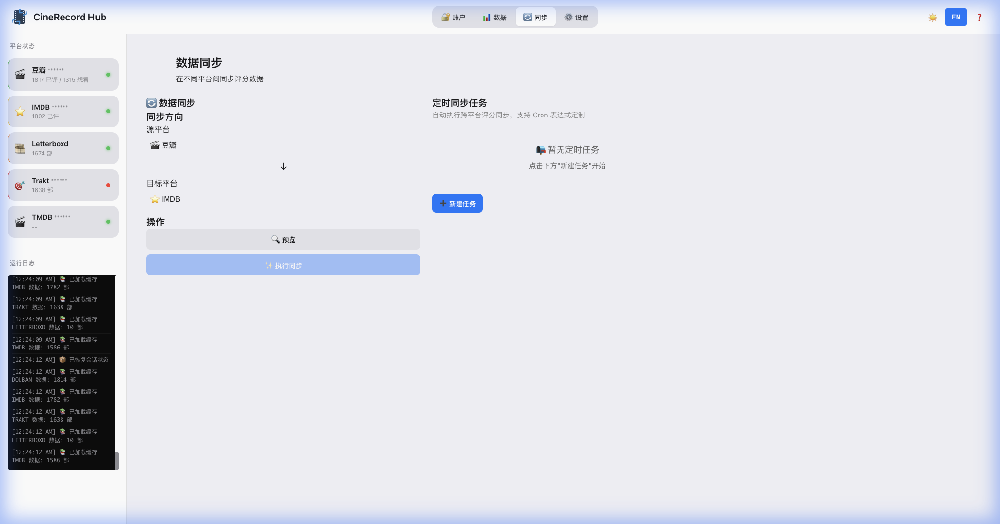

# 🎬 CineRecord Hub

<div align="center">

**您的私人电影数据管理中心**

一站式同步、备份和管理您的电影评分：支持豆瓣、IMDb、Trakt、TMDB 和 Letterboxd。

[](https://python.org)
[](https://flask.palletsprojects.com)
[](https://opensource.org/licenses/MIT)

[English](./README.en.md) | [中文文档](./README.md)

</div>

---


## 📸 界面展示

<div align="center">
  
  <p><i>快速演示：仪表盘概览与任务流程 (中英双语演示)</i></p>

  <br>

  
  <p><i>仪表盘：账户状态与概览 (个人信息已打码处理)</i></p>

  <br>

  
  <p><i>支持多平台数据聚合与 CSV 导出功能</i></p>

  <br>

  
  <p><i>可视化任务调度与实时状态监控</i></p>
</div>

---

## ✨ 核心特性

### 🌐 多平台支持

| 平台 | 获取评分 | 同步至 | 认证方式 |
|------|:--------:|:-------:|-------------|
| **豆瓣** | ✅ | ✅ | Cookie / 自动登录 |
| **IMDb** | ✅ | ✅ | Cookie / 自动登录 |
| **Trakt** | ✅ | ✅ | OAuth 设备授权 |
| **TMDB** | ✅ | ✅ | API Key + Session |
| **Letterboxd**| ✅ | ⚠️ | CSV 导入 / 导出 |

### ⚡ 核心能力

-   **统一电影库**：在一个地方查看您看过的所有电影，自动去重。
-   **双向同步**：保持各平台评分一致（例如：自动把豆瓣评分同步到 IMDb）。
-   **定时任务**：**[新增]** 设置自动每日/每周同步任务，彻底解放双手。
-   **隐私优先**：所有数据和 Cookie 仅保存在您本地电脑上。
-   **深色界面**：影院级的高级视觉体验。

---

## 🚀 快速开始

### 标准安装

1.  **克隆仓库**
    ```bash
    git clone https://github.com/YOUR_USERNAME/CineRecord.git
    cd CineRecord
    ```

2.  **安装依赖**
    ```bash
    pip install -r requirements.txt
    ```

3.  **启动应用**
    ```bash
    python web/app.py
    ```
    浏览器将自动打开 `http://127.0.0.1:8000`。

---

## 📖 使用指南

### 1. 连接账户
前往 **账户**页 或各平台卡片。
-   **豆瓣/IMDb**：使用“自动登录”按钮（macOS）或在**设置**中手动粘贴 Cookie。
-   **Trakt**：点击“连接”，获取 8 位代码并在 Trakt.tv 完成授权。
-   **TMDB**：在设置中输入 API Key 以启用搜索和同步。

### 2. 同步评分
前往 **同步** 页。
-   **手动同步**：选择源平台（如豆瓣）和目标平台（如 Trakt），点击“预览”，确认无误后点击“执行同步”。
-   **定时同步**：点击“新建任务”，选择同步方向和频率（如“每天凌晨 2:00”），启用即可。App 将在后台自动处理。

### 3. 查看电影库
**数据** 页是您的统一电影数据库。您可以通过筛选“平台独占”来查看哪些电影还没有同步到其他平台。

---

## 🛠 项目结构

```
CineRecord/
├── web/
│   ├── app.py             # 后端应用入口
│   ├── scheduler.py       # 定时任务服务
│   ├── logic.py           # 同步与合并逻辑
│   ├── static/            # 前端资源 (JS, Scheduler, i18n, CSS)
│   └── templates/         # HTML 页面模板
├── scrapers/              # 平台连接器
│   ├── douban_scraper.py
│   ├── imdb_scraper.py
│   ├── trakt_client.py
│   └── tmdb_client.py
└── data/                  # 本地数据存储
```

---

## 🛡️ 隐私与安全

-   **仅限本地**：您的 Cookie 和电影数据永远不会离开您的本地网络。
-   **开源**：代码完全透明，可供审计。
-   **无追踪**：我们不收集任何使用数据。

---

## 🤝 贡献

欢迎提交贡献！请查阅 `AI_ROADMAP.md` 获取开发指南。

## 📜 许可证

MIT License. 详见 [LICENSE](./LICENSE)。
