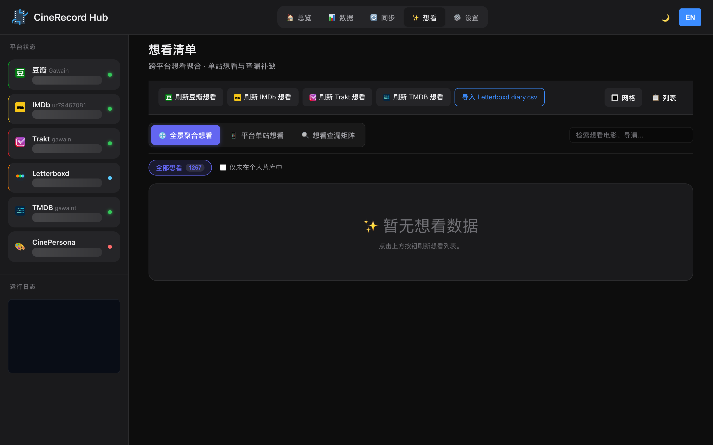

# 🎬 CineRecord

CineRecord 是一个本地优先的跨平台电影记录管理、评分同步与想看清单工具。

本项目由原 Python 版本全面重写为高性能 **Rust** 后端与本地 **SQLite** 存储，前端直接由单一独立编译的可执行二进制提供，**不需要 Python、Node.js 运行环境，也无需额外配置复杂的外部数据库服务**。

<div align="center">
  
  <p><i>运行流程演示：账户状态与全量/定时同步任务流（双语版）</i></p>
</div>

---

## 📸 界面预览

<div align="center">
  
  <p><i>仪表盘：账户连接状态与各平台观影概览</i></p>

  <br>

  
  <p><i>影片数据中心：多平台观影数据聚合、去重及筛选查询</i></p>

  <br>

  
  <p><i>数据同步：可视化任务差分比对、执行和实时日志控制台</i></p>

  <br>

  
  <p><i>想看清单：聚合各源平台想看数据，支持比对媒体服务器找出未入库影片并一键检索</i></p>
</div>

---

## ✨ 核心特性

### 🌐 平台支持矩阵

| 平台 | 看过/评分抓取 | 想看列表抓取 | 同步目标支持 | 认证与交互方式 |
| :--- | :---: | :---: | :---: | :--- |
| **🎬 豆瓣 (Douban)** | ✅ | ✅ | ✅ | Cookie 导入验证 / 授权绑定 |
| **⭐ IMDb** | ✅ | ✅ | ✅ | Cookie 登录验证 |
| **🎯 Trakt** | ✅ | ✅ | ✅ | 官方设备 OAuth 授权 / 评分与想看同步 |
| **🎬 TMDB** | ✅ | ✅ | ✅ | API Key + 用户 Session 验证 |
| **🎨 CinePersona** | ✅ | ✅ | ✅ | API Key 开放接口双向想看及看过同步 |
| **✉️ Letterboxd** | ✅ (导入) | ✅ (导入) | ⚠️ (导出) | 本地 diary.csv / watchlist.csv 导入导出 |
| **🎬 媒体服务器** | ✅ (比对) | — | — | Emby / Jellyfin / Plex API 集成与直达播放 |

### ⚡ 核心能力

* **🚀 极致轻量与高响应性**：打包后的二进制体积仅约 10MB，常驻内存占用极低（约 15MB），启动秒开。
* **📊 统一媒体库**：聚合各平台观影记录，基于 IMDb/TMDb ID 自动去重，提供类型、地区、评分及主创等丰富元数据。
* **📅 智能想看清单 (Wishlist)**：汇聚各平台想看条目，支持单站想看与跨平台查漏补缺，支持双向想看同步。
* **🔍 媒体服务器查重 & 库内直达播放**：深度集成 Emby、Jellyfin 和 Plex 媒体库，自动比对想看清单与本地媒体库，已入库条目可一键直达网页端播放。
* **🌐 多站点一键资源检索**：针对未入库影片，内置 KG、HDR、Tik、IN、HDB、OMG、BHD、ADE 等主流检索站点快捷跳转，智能支持 IMDb ID 与标题回退。
* **⚙️ 可视化任务调度**：内置定时任务调度器，支持配置每日/每周自动刷新和同步任务，配备 SSE 实时日志流。
* **🌍 中英双语与主题自适应**：全界面即时中英文无缝切换，提供深色与浅色双套高对比度精致 UI。
* **🔒 隐私与本地优先**：敏感凭据（Cookies、Tokens、API 密钥）加密存储于本地，零遥测代码，数据完全归您所有。

---

## 🚀 快速开始

### 从源码运行

确保已安装 Rust 工具链（建议 Rust 1.75+）：

```bash
# 1. 克隆代码仓库
git clone https://github.com/Gawain12/CineRecord.git
cd CineRecord

# 2. 运行 Axum 后端服务
cargo run -p cinerecord-server
```

启动后在浏览器中打开：[http://127.0.0.1:18000](http://127.0.0.1:18000)。

### Docker 容器部署

如果您要在 NAS 或服务器上运行，推荐使用 Docker：

```bash
docker compose up -d --build
```
服务将在 `http://127.0.0.1:18000` 运行，持久化配置和数据库文件保存在宿主机的 `./cinerecord-data` 目录。

---

## 📦 打包发布

CineRecord 提供了全自动的原生打包脚本，生成不依赖任何外部环境的独立桌面运行程序：

### 🍎 macOS
运行封装脚本，自动生成高分辨率 `.icns` 图标，编译 Release 二进制并打包为 DMG 磁盘镜像和 ZIP 文件：
```bash
./scripts/package_rust_macos.sh
```
* **输出路径**：`dist-rust/CineRecord.app` / `CineRecord-macOS-arm64.dmg`。
* 双击运行后应用在后台常驻，并自动打开浏览器。

### 🔌 Windows
在 PowerShell 下运行打包脚本，自动嵌入图标并生成独立 EXE 可执行文件：
```powershell
.\scripts\package_rust_windows.ps1
```
* **输出路径**：`dist-rust/CineRecord-Windows-x64.exe` 及 ZIP 发布包。

---

## ⚙️ 运行配置与环境变量

CineRecord 的默认配置文件、SQLite 数据库以及运行日志保存在系统标准路径：
* **macOS**: `~/Library/Application Support/CineRecord`
* **Windows**: `%APPDATA%\CineRecord`
* **Linux**: `$XDG_DATA_HOME/cinerecord` 或 `~/.local/share/cinerecord`

支持以下环境变量自定义服务行为：

| 环境变量 | 默认值 | 作用描述 |
| :--- | :--- | :--- |
| `CINERECORD_HOME` | 系统默认标准路径 | 重定向本地配置、SQLite 数据库及日志的根目录 |
| `CINERECORD_HOST` | `127.0.0.1` | 服务监听的 IP 地址 |
| `CINERECORD_PORT` | `18000` | 服务监听的端口号 |
| `CINERECORD_PORTABLE` | `false` | 若设为 `true`，数据直接存储在程序运行目录下，适合便携式 U 盘 |
| `RUST_LOG` | `info,tower_http=warn` | 控制控制台日志输出级别 |

---

## 🛡️ 同步安全防护机制

为了防止同步覆盖和脏数据破坏您的各平台原有电影库，CineRecord 实现了多重防护：
1. **多重比对差分**：同步预览默认利用本地高速数据库完成比对，在正式写入目标平台前，会**强制静默刷新**双方最新的云端数据，确保版本完全一致。
2. **只增不改保护**：同步模式默认使用 **「仅新增」** 机制，本地未评分的记录绝对不会覆盖目标平台已有的评分。
3. **排除 TV 剧集**：由于 TMDB、Letterboxd 和 CinePersona 对电视剧（TV Shows）的兼容与同步方式存在差异，同步任务将自动过滤普通电视剧集，仅保留电影和少部分 IMDb 单季迷你剧，避免导入杂乱。
4. **精细化控制**：支持在执行同步清单前，在前端预览卡片中人工全选、取消勾选任意条目，做到百分百所见即所得。

---

## ♻️ 从原 Python 版本迁移历史数据

如果您以前使用过 Python 版本的 CineRecord，无需重新抓取全部数据：
1. 打开 CineRecord 页面，进入数据中心。
2. 点击 **「导入旧版 CSV」**。
3. 系统将自动寻找您以前存放在 `data/` 目录下的 Python 版导出的 CSV 文件（如 `douban_*_wish.csv`、`imdb_*_ratings.csv` 等），一键清洗并迁移导入到 SQLite 数据库中。

---

## 📜 License

[MIT License](./LICENSE)
